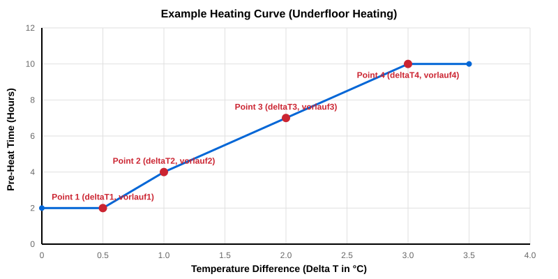
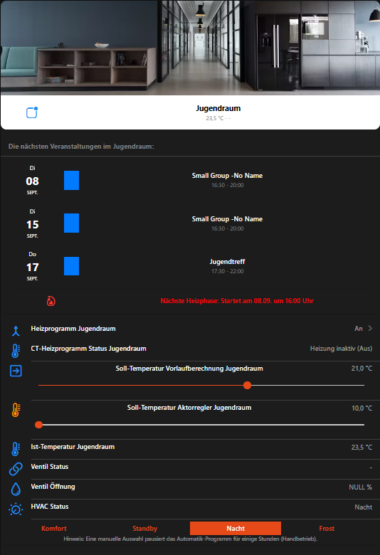

# ChurchTools Heating Binding

This binding integrates the [ChurchTools](https://church.tools/) API to automatically control heating and HVAC systems in your building based on room bookings and calendars. 

It allows you to map ChurchTools "Resources" (Rooms) to openHAB and calculates dynamic pre-heating times based on target temperatures and current temperatures.

## Pre-Heating Calculation (Vorlaufzeit)

One of the core features of this binding is its intelligent pre-heating calculation. Instead of starting the heating exactly when an event begins, it calculates how long the room needs to heat up to reach the target temperature *before* the event starts.

It does this by calculating the temperature difference (**Delta T**) between the `targetTemperature` and the `currentTemperature`. You configure a heating curve using four interpolation points in the Thing configuration:

- `deltaT1` -> `vorlauf1` (z.B. 0.5 °C diff = 1.0 hours of heating)
- `deltaT2` -> `vorlauf2` (z.B. 1.0 °C diff = 2.5 hours of heating)
- `deltaT3` -> `vorlauf3`
- `deltaT4` -> `vorlauf4`

If the current temperature difference falls between two points (e.g., 1.5 °C), the binding automatically interpolates the required time and turns on the `heatingRelay` / sets the `hvacMode` accordingly prior to the event.

> [!IMPORTANT]
> **Configuration Required:** Because every room has different heating systems, sizes, and insulation, there is no "one size fits all" curve. Therefore, to actually use the pre-heating feature, you **MUST** configure the 4 points (`deltaT1-4` and `vorlauf1-4`) in the Thing configuration for *each individual room*. If you leave these fields empty, the binding defaults to 0 hours, meaning the heating will start exactly when the event begins.

### Example Heating Curves (Muster-Heizkurven)

Different heating systems react at vastly different speeds. Below are two typical starting points for your configuration:

#### 1. Underfloor Heating (Fußbodenheizung)
Underfloor heating systems are notoriously slow. A typical configuration for a well-insulated building might look like this:
- **Punkt 1:** `deltaT1 = 0.5` °C ➔ `vorlauf1 = 2.0` h *(Only slightly cold, needs 2 hours to warm up)*
- **Punkt 2:** `deltaT2 = 1.0` °C ➔ `vorlauf2 = 4.0` h *(1 degree cold, needs 4 hours)*
- **Punkt 3:** `deltaT3 = 2.0` °C ➔ `vorlauf3 = 7.0` h *(2 degrees cold, needs 7 hours)*
- **Punkt 4:** `deltaT4 = 3.0` °C ➔ `vorlauf4 = 10.0` h *(3 degrees cold, needs a massive 10 hours)*

#### 2. Traditional Radiators (Heizkörper)
Standard wall radiators heat up the air much faster. A typical configuration:
- **Punkt 1:** `deltaT1 = 0.5` °C ➔ `vorlauf1 = 0.5` h *(30 minutes to warm up)*
- **Punkt 2:** `deltaT2 = 1.0` °C ➔ `vorlauf2 = 1.0` h *(1 hour for 1 degree)*
- **Punkt 3:** `deltaT3 = 2.0` °C ➔ `vorlauf3 = 2.0` h *(2 hours for 2 degrees)*
- **Punkt 4:** `deltaT4 = 3.0` °C ➔ `vorlauf4 = 3.0` h *(3 hours for 3 degrees)*



*Note: You may want to configure `maxEventDuration` or check ChurchTools limitations if you have extremely long pre-heat times.*


## Manual Override (Handbetrieb)

If a user manually changes the physical KNX thermostat on the wall (or via a UI widget), the binding can detect this and temporarily suspend the automatic heating schedule. 

To use this feature, you must enable `enableExternalManualMode` in the Thing configuration. 
When enabled, any deviation from the binding's expected HVAC mode will trigger the **Manual Override**. 

> [!IMPORTANT]
> **Configure the Pause Duration:** You must configure how long the automation should pause when a manual override is detected using the `externalManualModeDuration` parameter. The default is 6 hours. If a user manually changes the thermostat during a Sunday service, the automation will "sleep" for exactly this amount of time (e.g. 6 hours) before taking back control.

**Resetting the Override:**
The manual override is automatically cleared when:
1. The `externalManualModeDuration` expires.
2. A completely **new** heating phase (a new event in ChurchTools) starts.
3. The user toggles the `heatingEnabled` switch OFF and ON again.

## Summer Mode (Sommerbetrieb)

The binding supports a global "Summer Mode" switch via the `summerMode` channel. 
When this channel is switched to `ON`:
1. All heating logic is immediately bypassed for the room.
2. An active shut-off command (`offHvacMode`) is sent to the KNX bus once.
3. The binding completely stops calculating pre-heating times or reacting to upcoming events.

When switched back to `OFF`, the automation resumes and evaluates the current calendar state instantly.

## Polling & API Fetching (Terminabruf & Reaktion)

To ensure the binding reacts immediately without overwhelming the ChurchTools server, the scheduling logic is split into two layers:
1. **API Fetching (Cache):** The binding fetches the latest calendar data from ChurchTools only once every `refreshInterval` (configured on the Bridge, e.g., 15 minutes). This data is cached internally.
2. **Logic Evaluation (Fast Reaction):** The binding evaluates the *cached* calendar data every single minute. 

This means that if a ChurchTools event officially ends at 22:45, the binding will notice this exactly at 22:45 (or 22:46 at the latest) and turn off the heating immediately, even if the next API fetch is scheduled much later.

## Event Filtering (Sicherheit & Filter)

To prevent the heating system from running unnecessarily or endlessly, the binding implements several built-in safety filters that can be configured in the Thing settings:

1. **Confirmed Bookings Only (`onlyConfirmedBookings`):** By default, the binding only looks at events in ChurchTools that have the status "Confirmed". Unconfirmed or rejected requests are completely ignored so the room stays cold.
2. **Maximum Event Duration (`enableMaxDurationFilter` / `maxEventDuration`):** A common mistake in calendar systems is booking a room for "multiple days" instead of just a few hours. By default, any event longer than 10 hours is ignored to prevent the heating from running for days straight. You can adjust this limit or disable it entirely.

## Supported Things

This binding supports the following thing types:

| Thing Type ID | Description |
|---|---|
| `api` | The Bridge to the ChurchTools API. |
| `roomHeater` | Represents a single room (Resource) that is heated automatically based on events. |

## Discovery

Currently, there is no automatic discovery. You must configure the Bridge and Things manually.

## Binding Configuration

The binding itself does not require any special configuration at the binding level. All configuration is done on the Bridge (`api`) and Things (`roomHeater`).

## Bridge Configuration

The `api` bridge requires the following configuration parameters:

| Parameter | Type | Required | Default | Description |
|---|---|---|---|---|
| `url` | text | Yes | | The base URL of your ChurchTools instance (e.g., `https://mychurch.church.tools`). |
| `token` | text | Yes | | A login token of a user with read permissions for resources and calendars. |
| `refreshInterval` | integer | No | 15 | How often (in minutes) the bookings should be fetched. |
| `roomResourceTypeId` | integer | No | 2 | The ID of the Resource Type for "Rooms" in ChurchTools. |

## Thing Configuration

The `roomHeater` requires the `api` bridge and the following parameters:

| Parameter | Type | Required | Default | Description |
|---|---|---|---|---|
| `resourceId` | integer | Yes | | The ID of the Resource (Room) in ChurchTools. |
| `onlyConfirmedBookings` | boolean | No | true | If true, only bookings with status "Confirmed" are used for heating. |
| `enableMaxDurationFilter` | boolean | No | true | Prevents infinite heating if an event is accidentally booked for days. |
| `maxEventDuration` | integer | No | 10 | Max duration of an event (in hours) to be considered for heating. |
| `enablePreheating` | boolean | No | true | If disabled, heating starts exactly at event start time without pre-heat calculation. |
| `enableExternalManualMode`| boolean | No | false | Detects manual override on physical KNX thermostats and pauses automation. |
| `externalManualModeDuration`| integer | No | 6 | How long (in hours) the automation pauses on manual override. |
| `offHvacMode` | integer | No | 3 | KNX HVAC Mode to send when turning off (1=Comfort, 2=Standby, 3=Night, 4=Frost). |
| `deltaT1` ... `deltaT4` | decimal | No | ... | Temperature deltas for pre-heat curve calculation. |
| `vorlauf1` ... `vorlauf4` | decimal | No | ... | Pre-heat durations (in hours) mapped to the deltaT points. |

## Channels

The `roomHeater` thing provides the following channels:

| Channel Type ID | Item Type | Description |
|---|---|---|
| `currentTemperature` | Number:Temperature | The current temperature in the room (Input from e.g., KNX) |
| `targetTemperature` | Number:Temperature | The desired target temperature (Used for pre-heat calculation) |
| `heatingRelay` | Switch | The calculated state (ON/OFF) of the heating |
| `hvacMode` | Number | The calculated KNX HVAC mode (1=Comfort, 2=Standby, 3=Night, 4=Frost) |
| `nextEventStart` | DateTime | Start time of the next upcoming event |
| `nextEventEnd` | DateTime | End time of the next upcoming event |
| `heatingStart` | DateTime | Calculated time when the heating will switch to ON (including pre-heat) |
| `heatingEnabled` | Switch | Master switch to enable/disable the automation for this room |
| `summerMode` | Switch | Global switch to disable heating for all rooms (ignores events) |
| `upcomingEvent1` | String | Name of the next upcoming event |
| `manualOverrideUntil`| DateTime | Shows until when the automation is paused due to manual intervention |

## UI Widget

To make controlling and visualizing the heating system as easy as possible, a pre-built openHAB MainUI Widget is included in this repository.

You can find the widget code in the following location:
**`widget/churchtools_room_widget.json`**

You can import this JSON file directly into your openHAB Developer Tools -> Widgets section. It automatically supports displaying the upcoming events, current/target temperatures, and manual overrides.



## Full Example

### `churchtools.things`
```java
Bridge churchtoolsheating:api:mychurch "ChurchTools API" [ url="https://mychurch.church.tools", token="YOUR_TOKEN", refreshInterval=15 ] {
    Thing roomHeater saal "Saal Heizung" [ resourceId=12, onlyConfirmedBookings=true, offHvacMode=3 ]
}
```

### `churchtools.items`
```java
// Bridge/Global Items
Switch Global_summerMode "Sommerbetrieb"

// Room Items (Saal)
Number:Temperature Raum_Saal_currentTemperature "Ist-Temperatur [%.1f °C]" { channel="churchtoolsheating:roomHeater:mychurch:saal:currentTemperature", channel="knx:device:bridge:saal:currentTemp" }
Number:Temperature Raum_Saal_targetTemperature "Soll-Temperatur Vorlauf [%.1f °C]" { channel="churchtoolsheating:roomHeater:mychurch:saal:targetTemperature" }

Switch Raum_Saal_heatingRelay "Heizungsrelais (Heizphase aktiv)" { channel="churchtoolsheating:roomHeater:mychurch:saal:heatingRelay" }
Number Raum_Saal_hvacMode "HVAC Modus" { channel="churchtoolsheating:roomHeater:mychurch:saal:hvacMode", channel="knx:device:bridge:saal:hvacMode" }
Number:Temperature Raum_Saal_actuatorTargetTemp "Aktuelle Aktor-Soll-Temperatur [%.1f °C]" { channel="churchtoolsheating:roomHeater:mychurch:saal:actuatorTargetTemp" }

Switch Raum_Saal_heatingEnabled "Heizautomatik An/Aus" { channel="churchtoolsheating:roomHeater:mychurch:saal:heatingEnabled" }
Switch Raum_Saal_summerMode "Sommerbetrieb Saal" { channel="churchtoolsheating:roomHeater:mychurch:saal:summerMode" }
DateTime Raum_Saal_manualOverrideUntil "Handbetrieb Pause bis [%1$tH:%1$tM]" { channel="churchtoolsheating:roomHeater:mychurch:saal:manualOverrideUntil" }

DateTime Raum_Saal_nextEventStart "Nächster Termin Start [%1$td.%1$tm. %1$tH:%1$tM]" { channel="churchtoolsheating:roomHeater:mychurch:saal:nextEventStart" }
DateTime Raum_Saal_nextEventEnd "Nächster Termin Ende [%1$td.%1$tm. %1$tH:%1$tM]" { channel="churchtoolsheating:roomHeater:mychurch:saal:nextEventEnd" }
DateTime Raum_Saal_heatingStart "Geplanter Heizbeginn [%1$td.%1$tm. %1$tH:%1$tM]" { channel="churchtoolsheating:roomHeater:mychurch:saal:heatingStart" }
DateTime Raum_Saal_actualHeatingStart "Tatsächlicher Heizbeginn [%1$tH:%1$tM]" { channel="churchtoolsheating:roomHeater:mychurch:saal:actualHeatingStart" }
String Raum_Saal_upcomingEvent1 "Nächster Termin: [%s]" { channel="churchtoolsheating:roomHeater:mychurch:saal:upcomingEvent1" }
```

### `churchtools.sitemap`
```java
sitemap churchtools label="ChurchTools Heizung" {
    Frame label="Globale Einstellungen" {
        Switch item=Global_summerMode icon="sun"
    }
    
    Frame label="Saal Heizung" {
        Text item=Raum_Saal_upcomingEvent1
        Text item=Raum_Saal_nextEventStart icon="calendar"
        Text item=Raum_Saal_nextEventEnd icon="calendar"
        
        Text item=Raum_Saal_heatingStart icon="time"
        Text item=Raum_Saal_actualHeatingStart icon="time" visibility=[Raum_Saal_actualHeatingStart!="UNDEF"]
        
        Text item=Raum_Saal_currentTemperature icon="temperature"
        Setpoint item=Raum_Saal_targetTemperature icon="heating" minValue=15 maxValue=28 step=0.5
        Text item=Raum_Saal_actuatorTargetTemp icon="temperature"
        
        Text item=Raum_Saal_heatingRelay icon="fire"
        Selection item=Raum_Saal_hvacMode mappings=[1="Komfort", 2="Standby", 3="Nacht", 4="Frost"]
        
        Switch item=Raum_Saal_heatingEnabled icon="switch"
        Text item=Raum_Saal_manualOverrideUntil icon="time" visibility=[Raum_Saal_manualOverrideUntil!="UNDEF"] valuecolor=["red"]
        Switch item=Raum_Saal_summerMode icon="sun"
    }
}
```

### Note on KNX Setpoints
For a robust setup with smart KNX thermostats, it is highly recommended to link the `targetTemperature` channel ONLY to a virtual openHAB item. The binding uses this virtual item solely to calculate the pre-heat duration. The actual KNX actuator should be controlled exclusively via the `hvacMode` channel, relying on the actuator's internal base setpoint. Changing KNX setpoints dynamically via OpenHAB often causes the thermostat to immediately jump to Comfort mode, breaking the automation cycle.

(docs/images/ct_heatbindig_oh5.gif)
